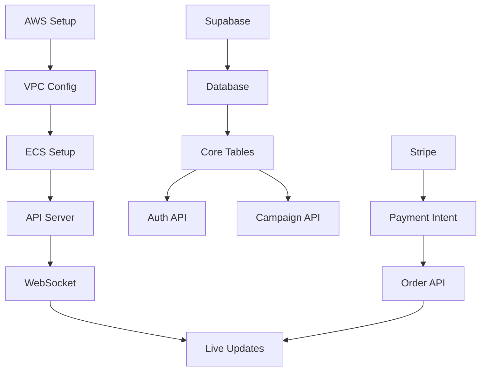

# DROPWAVE Technical Task Breakdown & Implementation Guide

## Executive Summary
This document provides a comprehensive technical breakdown of all tasks required to implement the DROPWAVE platform. Each section details specific tasks, dependencies, effort estimates, required skills, and infrastructure requirements for successful execution.

---

## 1. Infrastructure Setup & Configuration Tasks

### 1.1 Cloud Infrastructure Foundation

#### Core Infrastructure Tasks
| Task ID | Task Description | Dependencies | Effort | Complexity | Required Skills |
|---------|-----------------|--------------|---------|------------|-----------------|
| INF-001 | AWS Account Setup & IAM Configuration | None | 4h | Low | DevOps, AWS |
| INF-002 | VPC Network Architecture Design | INF-001 | 8h | Medium | Network Engineering |
| INF-003 | Multi-AZ Subnet Configuration | INF-002 | 6h | Medium | AWS Networking |
| INF-004 | Security Groups & NACLs Setup | INF-002 | 6h | Medium | Security, AWS |
| INF-005 | Route53 DNS Configuration | INF-001 | 3h | Low | DNS Management |
| INF-006 | CloudFront CDN Setup | INF-005 | 6h | Medium | CDN, Performance |
| INF-007 | S3 Bucket Configuration (Static Assets) | INF-001 | 4h | Low | AWS S3 |
| INF-008 | AWS Certificate Manager SSL Setup | INF-005 | 2h | Low | SSL/TLS |

#### Container Orchestration
| Task ID | Task Description | Dependencies | Effort | Complexity | Required Skills |
|---------|-----------------|--------------|---------|------------|-----------------|
| INF-009 | ECS/Fargate Cluster Setup | INF-002 | 8h | High | Container Orchestration |
| INF-010 | Task Definition Templates | INF-009 | 6h | Medium | Docker, ECS |
| INF-011 | Service Auto-Scaling Configuration | INF-009 | 8h | High | Auto-scaling, AWS |
| INF-012 | Application Load Balancer Setup | INF-003 | 6h | Medium | Load Balancing |
| INF-013 | Target Group Configuration | INF-012 | 4h | Medium | ALB, Health Checks |
| INF-014 | Container Registry (ECR) Setup | INF-009 | 3h | Low | Docker Registry |

#### Monitoring & Observability
| Task ID | Task Description | Dependencies | Effort | Complexity | Required Skills |
|---------|-----------------|--------------|---------|------------|-----------------|
| INF-015 | CloudWatch Configuration | INF-001 | 4h | Low | Monitoring, AWS |
| INF-016 | Custom Metrics & Alarms | INF-015 | 8h | Medium | CloudWatch, Alerting |
| INF-017 | DataDog Integration | INF-015 | 6h | Medium | DataDog, APM |
| INF-018 | Log Aggregation Setup (ELK/CloudWatch) | INF-015 | 8h | High | Logging, ElasticSearch |
| INF-019 | Distributed Tracing Implementation | INF-017 | 12h | High | OpenTelemetry, APM |
| INF-020 | Performance Dashboard Creation | INF-016,INF-017 | 8h | Medium | Grafana, DataDog |

#### Development Environment
| Task ID | Task Description | Dependencies | Effort | Complexity | Required Skills |
|---------|-----------------|--------------|---------|------------|-----------------|
| INF-021 | Staging Environment Setup | INF-009 | 8h | Medium | Infrastructure as Code |
| INF-022 | Development Environment Setup | INF-021 | 6h | Medium | Docker, Compose |
| INF-023 | Environment Variable Management | INF-021 | 4h | Low | Secrets Management |
| INF-024 | Terraform/CDK Infrastructure Code | INF-001 | 16h | High | IaC, Terraform |
| INF-025 | CI/CD Pipeline Architecture | INF-014 | 12h | High | GitHub Actions, AWS |

### Infrastructure Cost Estimates
- **Development Environment**: $200/month
- **Staging Environment**: $500/month  
- **Production Environment (Initial)**: $1,500/month
- **Production Environment (Scale)**: $5,000-15,000/month

### Testing & Validation Requirements
- Load testing with 10K concurrent users
- Failover testing for multi-AZ setup
- Auto-scaling trigger validation
- CDN cache hit ratio optimization
- Security penetration testing

---

## 2. Database Design & Implementation Tasks

### 2.1 Core Database Architecture

#### Database Setup
| Task ID | Task Description | Dependencies | Effort | Complexity | Required Skills |
|---------|-----------------|--------------|---------|------------|-----------------|
| DB-001 | Supabase Project Initialization | None | 2h | Low | Supabase, PostgreSQL |
| DB-002 | Database Schema Design Document | None | 8h | High | Database Architecture |
| DB-003 | Primary Database Instance Setup | DB-001 | 4h | Medium | PostgreSQL, RDS |
| DB-004 | Read Replica Configuration | DB-003 | 6h | Medium | Database Replication |
| DB-005 | Connection Pooling Setup (PgBouncer) | DB-003 | 6h | Medium | Connection Management |
| DB-006 | Backup & Recovery Strategy | DB-003 | 8h | High | Disaster Recovery |

#### Core Tables Implementation
| Task ID | Task Description | Dependencies | Effort | Complexity | Required Skills |
|---------|-----------------|--------------|---------|------------|-----------------|
| DB-007 | Users Table & Authentication | DB-003 | 6h | Medium | Auth, PostgreSQL |
| DB-008 | Creators Table with Verification | DB-007 | 4h | Medium | Data Modeling |
| DB-009 | Campaigns Table with Status FSM | DB-008 | 8h | High | State Management |
| DB-010 | Orders Table with Payment Status | DB-009 | 6h | Medium | Transaction Design |
| DB-011 | Products Table with Media | DB-009 | 4h | Medium | Media Storage |
| DB-012 | Themes Table for Customization | DB-009 | 6h | Medium | JSON Schema |
| DB-013 | Analytics Events Table | DB-003 | 4h | Medium | Event Sourcing |
| DB-014 | Notifications Table | DB-007 | 4h | Medium | Queue Design |

#### Database Optimization
| Task ID | Task Description | Dependencies | Effort | Complexity | Required Skills |
|---------|-----------------|--------------|---------|------------|-----------------|
| DB-015 | Index Strategy Implementation | DB-007 to DB-014 | 8h | High | Query Optimization |
| DB-016 | Materialized Views for Analytics | DB-013 | 6h | Medium | Performance Tuning |
| DB-017 | Partitioning Strategy (Time-based) | DB-013 | 8h | High | Table Partitioning |
| DB-018 | Query Performance Optimization | DB-015 | 12h | High | SQL Optimization |
| DB-019 | Database Monitoring Setup | DB-003 | 4h | Medium | Performance Monitoring |

#### Row-Level Security
| Task ID | Task Description | Dependencies | Effort | Complexity | Required Skills |
|---------|-----------------|--------------|---------|------------|-----------------|
| DB-020 | RLS Policy Design | DB-007 | 8h | High | Security, PostgreSQL |
| DB-021 | Creator Access Policies | DB-020 | 6h | Medium | RLS Implementation |
| DB-022 | Buyer Access Policies | DB-020 | 4h | Medium | RLS Implementation |
| DB-023 | Admin Access Policies | DB-020 | 4h | Medium | RLS Implementation |
| DB-024 | Policy Testing Suite | DB-021 to DB-023 | 8h | High | Security Testing |

### Database Schema SQL
```sql
-- Core campaign tracking
CREATE TABLE campaigns (
    id UUID PRIMARY KEY DEFAULT gen_random_uuid(),
    creator_id UUID REFERENCES creators(id),
    status campaign_status DEFAULT 'draft',
    min_orders INTEGER NOT NULL,
    current_orders INTEGER DEFAULT 0,
    deadline TIMESTAMP WITH TIME ZONE,
    theme_config JSONB,
    created_at TIMESTAMP WITH TIME ZONE DEFAULT NOW(),
    updated_at TIMESTAMP WITH TIME ZONE DEFAULT NOW()
);

-- Real-time order tracking
CREATE TABLE orders (
    id UUID PRIMARY KEY DEFAULT gen_random_uuid(),
    campaign_id UUID REFERENCES campaigns(id),
    buyer_email VARCHAR(255) NOT NULL,
    buyer_number INTEGER NOT NULL,
    amount DECIMAL(10,2) NOT NULL,
    status order_status DEFAULT 'pending',
    stripe_payment_intent_id VARCHAR(255),
    created_at TIMESTAMP WITH TIME ZONE DEFAULT NOW()
);

-- Indexes for performance
CREATE INDEX idx_campaigns_creator_status ON campaigns(creator_id, status);
CREATE INDEX idx_orders_campaign_status ON orders(campaign_id, status);
CREATE INDEX idx_orders_created_at ON orders(created_at DESC);
```

### Testing & Validation Requirements
- Load testing with 100K concurrent queries
- Replication lag monitoring (<100ms)
- Backup restoration testing (RTO < 1 hour)
- Query performance benchmarks (p99 < 50ms)
- Security audit for RLS policies

---

## 3. API Development & Integration Tasks

### 3.1 Backend API Architecture

#### Core API Setup
| Task ID | Task Description | Dependencies | Effort | Complexity | Required Skills |
|---------|-----------------|--------------|---------|------------|-----------------|
| API-001 | Node.js/Bun Server Setup | INF-009 | 4h | Low | Node.js, TypeScript |
| API-002 | GraphQL Schema Design | DB-002 | 8h | High | GraphQL, Schema Design |
| API-003 | REST API Architecture | DB-002 | 6h | Medium | REST, OpenAPI |
| API-004 | API Gateway Configuration | INF-012 | 6h | Medium | API Gateway, AWS |
| API-005 | Rate Limiting Implementation | API-004 | 6h | Medium | Redis, Rate Limiting |
| API-006 | API Authentication Middleware | DB-007 | 8h | High | JWT, OAuth |

#### Campaign Management APIs
| Task ID | Task Description | Dependencies | Effort | Complexity | Required Skills |
|---------|-----------------|--------------|---------|------------|-----------------|
| API-007 | Create Campaign Endpoint | API-003, DB-009 | 6h | Medium | REST, Validation |
| API-008 | Update Campaign Endpoint | API-007 | 4h | Medium | State Management |
| API-009 | Get Campaign Details | API-003, DB-009 | 3h | Low | Query Optimization |
| API-010 | List Creator Campaigns | API-003, DB-009 | 4h | Medium | Pagination |
| API-011 | Campaign Analytics API | API-003, DB-013 | 8h | High | Aggregation |
| API-012 | Campaign Status Webhook | API-008 | 6h | Medium | Webhooks, Events |

#### Order Processing APIs
| Task ID | Task Description | Dependencies | Effort | Complexity | Required Skills |
|---------|-----------------|--------------|---------|------------|-----------------|
| API-013 | Create Order Endpoint | API-003, DB-010 | 8h | High | Payment Processing |
| API-014 | Order Status Updates | API-013 | 4h | Medium | State Management |
| API-015 | Order Listing & Filtering | API-003, DB-010 | 6h | Medium | Query Building |
| API-016 | Bulk Order Export | API-015 | 4h | Medium | CSV/Excel Export |
| API-017 | Order Refund Processing | API-013 | 6h | High | Payment Refunds |

#### Creator Management APIs
| Task ID | Task Description | Dependencies | Effort | Complexity | Required Skills |
|---------|-----------------|--------------|---------|------------|-----------------|
| API-018 | Creator Registration | API-006, DB-008 | 6h | Medium | User Management |
| API-019 | TikTok OAuth Integration | API-018 | 8h | High | OAuth, TikTok API |
| API-020 | Creator Profile Management | API-018 | 4h | Medium | CRUD Operations |
| API-021 | Creator Verification System | API-018 | 8h | High | Verification Logic |
| API-022 | Creator Analytics Dashboard API | DB-013 | 8h | High | Data Aggregation |

#### Third-Party Integrations
| Task ID | Task Description | Dependencies | Effort | Complexity | Required Skills |
|---------|-----------------|--------------|---------|------------|-----------------|
| API-023 | Stripe Connect Integration | API-001 | 12h | High | Stripe API |
| API-024 | SendGrid Email Integration | API-001 | 4h | Low | Email APIs |
| API-025 | Twilio SMS Integration | API-001 | 4h | Low | SMS APIs |
| API-026 | CloudFlare Image API | API-001 | 6h | Medium | Image Processing |
| API-027 | TikTok API Integration | API-019 | 8h | High | Social APIs |

### API Testing Requirements
- Unit tests with >90% coverage
- Integration tests for all endpoints
- Load testing (10K requests/second)
- API documentation generation
- Security testing (OWASP Top 10)

---

## 4. Real-Time System Implementation

### 4.1 WebSocket Infrastructure

#### WebSocket Server Setup
| Task ID | Task Description | Dependencies | Effort | Complexity | Required Skills |
|---------|-----------------|--------------|---------|------------|-----------------|
| RT-001 | Socket.io Server Setup | API-001 | 6h | Medium | WebSockets, Node.js |
| RT-002 | Redis Pub/Sub Configuration | INF-001 | 4h | Medium | Redis, Pub/Sub |
| RT-003 | WebSocket Load Balancing | RT-001, INF-012 | 8h | High | Sticky Sessions |
| RT-004 | Connection Pool Management | RT-001 | 6h | Medium | Connection Management |
| RT-005 | Heartbeat & Reconnection Logic | RT-001 | 4h | Medium | WebSocket Protocol |

#### Real-Time Features
| Task ID | Task Description | Dependencies | Effort | Complexity | Required Skills |
|---------|-----------------|--------------|---------|------------|-----------------|
| RT-006 | Live Order Counter Updates | RT-001, API-013 | 8h | High | Real-time Sync |
| RT-007 | Progress Bar Animation Sync | RT-006 | 6h | Medium | State Synchronization |
| RT-008 | Buyer Activity Feed | RT-001, DB-010 | 6h | Medium | Event Streaming |
| RT-009 | Campaign Status Broadcasting | RT-001, DB-009 | 4h | Medium | Event Broadcasting |
| RT-010 | Creator Dashboard Live Updates | RT-001 | 8h | High | Dashboard Real-time |

#### Scaling & Performance
| Task ID | Task Description | Dependencies | Effort | Complexity | Required Skills |
|---------|-----------------|--------------|---------|------------|-----------------|
| RT-011 | Horizontal Scaling Strategy | RT-003 | 8h | High | Distributed Systems |
| RT-012 | Message Queue Implementation | RT-002 | 6h | Medium | Queue Management |
| RT-013 | Event Deduplication | RT-012 | 4h | Medium | Event Processing |
| RT-014 | Batch Update Optimization | RT-006 | 6h | Medium | Performance Tuning |
| RT-015 | Connection Limit Management | RT-004 | 4h | Medium | Resource Management |

### Real-Time Architecture Components
```javascript
// WebSocket event structure
const eventTypes = {
  CAMPAIGN_UPDATE: 'campaign:update',
  ORDER_CREATED: 'order:created',
  PROGRESS_UPDATE: 'progress:update',
  BUYER_JOINED: 'buyer:joined',
  MILESTONE_REACHED: 'milestone:reached'
};

// Redis channels for pub/sub
const channels = {
  CAMPAIGN_EVENTS: 'campaign:{campaignId}:events',
  GLOBAL_FEED: 'global:activity:feed',
  CREATOR_DASHBOARD: 'creator:{creatorId}:dashboard'
};
```

### Testing Requirements
- Concurrent connection testing (10K simultaneous)
- Message delivery reliability testing
- Reconnection resilience testing
- Load balancing effectiveness
- Latency measurements (<100ms p99)

---

## 5. Payment Processing Integration

### 5.1 Stripe Implementation

#### Core Payment Setup
| Task ID | Task Description | Dependencies | Effort | Complexity | Required Skills |
|---------|-----------------|--------------|---------|------------|-----------------|
| PAY-001 | Stripe Account Setup | None | 2h | Low | Stripe Dashboard |
| PAY-002 | Stripe Connect Configuration | PAY-001 | 6h | High | Stripe Connect |
| PAY-003 | Payment Intent Architecture | PAY-001, API-001 | 8h | High | Payment Processing |
| PAY-004 | Webhook Endpoint Setup | PAY-001, API-001 | 6h | Medium | Webhooks |
| PAY-005 | Idempotency Key Management | PAY-003 | 4h | Medium | Payment Safety |

#### Payment Flow Implementation
| Task ID | Task Description | Dependencies | Effort | Complexity | Required Skills |
|---------|-----------------|--------------|---------|------------|-----------------|
| PAY-006 | Authorization Flow | PAY-003 | 8h | High | Payment Authorization |
| PAY-007 | Capture on Campaign Success | PAY-006, DB-009 | 6h | High | Payment Capture |
| PAY-008 | Refund on Campaign Failure | PAY-006 | 6h | High | Refund Processing |
| PAY-009 | Split Payment to Creators | PAY-002 | 8h | High | Payment Splitting |
| PAY-010 | Platform Fee Calculation | PAY-009 | 4h | Medium | Fee Management |

#### Payment Security
| Task ID | Task Description | Dependencies | Effort | Complexity | Required Skills |
|---------|-----------------|--------------|---------|------------|-----------------|
| PAY-011 | PCI Compliance Setup | PAY-001 | 8h | High | PCI DSS |
| PAY-012 | Fraud Detection Rules | PAY-003 | 6h | High | Fraud Prevention |
| PAY-013 | 3D Secure Implementation | PAY-003 | 6h | Medium | 3DS Authentication |
| PAY-014 | Payment Method Validation | PAY-003 | 4h | Medium | Card Validation |
| PAY-015 | Chargeback Management | PAY-001 | 6h | High | Dispute Handling |

#### Alternative Payment Methods
| Task ID | Task Description | Dependencies | Effort | Complexity | Required Skills |
|---------|-----------------|--------------|---------|------------|-----------------|
| PAY-016 | Apple Pay Integration | PAY-003 | 6h | Medium | Apple Pay SDK |
| PAY-017 | Google Pay Integration | PAY-003 | 6h | Medium | Google Pay SDK |
| PAY-018 | PayPal Backup Integration | PAY-001 | 8h | High | PayPal API |
| PAY-019 | BNPL Options (Klarna/Afterpay) | PAY-003 | 8h | High | BNPL APIs |

### Payment Testing Requirements
- Test mode transaction testing
- Payment failure scenario testing
- Webhook reliability testing
- Refund processing validation
- International payment testing

---

## 6. Scaling & Performance Optimization

### 6.1 Performance Engineering

#### Frontend Optimization
| Task ID | Task Description | Dependencies | Effort | Complexity | Required Skills |
|---------|-----------------|--------------|---------|------------|-----------------|
| PERF-001 | Code Splitting Implementation | None | 6h | Medium | Webpack, React |
| PERF-002 | Lazy Loading Components | PERF-001 | 4h | Medium | React.lazy |
| PERF-003 | Image Optimization Pipeline | None | 6h | Medium | Image Processing |
| PERF-004 | Bundle Size Optimization | PERF-001 | 8h | High | Bundle Analysis |
| PERF-005 | Service Worker Implementation | None | 6h | Medium | PWA, Caching |

#### Backend Optimization
| Task ID | Task Description | Dependencies | Effort | Complexity | Required Skills |
|---------|-----------------|--------------|---------|------------|-----------------|
| PERF-006 | Database Query Optimization | DB-018 | 12h | High | SQL Tuning |
| PERF-007 | API Response Caching | API-003 | 6h | Medium | Redis, Caching |
| PERF-008 | Connection Pool Tuning | DB-005 | 4h | Medium | Database Pools |
| PERF-009 | N+1 Query Prevention | PERF-006 | 8h | High | ORM Optimization |
| PERF-010 | Batch Processing Implementation | API-003 | 6h | Medium | Bulk Operations |

#### Caching Strategy
| Task ID | Task Description | Dependencies | Effort | Complexity | Required Skills |
|---------|-----------------|--------------|---------|------------|-----------------|
| PERF-011 | Redis Cache Layer | RT-002 | 6h | Medium | Redis, Caching |
| PERF-012 | CDN Cache Configuration | INF-006 | 4h | Medium | CDN, CloudFlare |
| PERF-013 | Browser Cache Headers | API-003 | 3h | Low | HTTP Headers |
| PERF-014 | Database Result Caching | PERF-011 | 6h | Medium | Query Caching |
| PERF-015 | Session Cache Management | PERF-011 | 4h | Medium | Session Storage |

#### Load Testing & Benchmarking
| Task ID | Task Description | Dependencies | Effort | Complexity | Required Skills |
|---------|-----------------|--------------|---------|------------|-----------------|
| PERF-016 | Load Testing Suite Setup | None | 8h | Medium | K6, JMeter |
| PERF-017 | Stress Testing Scenarios | PERF-016 | 6h | Medium | Performance Testing |
| PERF-018 | Performance Baseline Establishment | PERF-016 | 4h | Medium | Benchmarking |
| PERF-019 | Auto-scaling Validation | INF-011 | 6h | High | Load Testing |
| PERF-020 | Performance Monitoring Dashboard | INF-020 | 6h | Medium | Grafana, Metrics |

### Performance Targets
- Page Load Time: <1s (LCP)
- Time to Interactive: <2s
- API Response Time: <200ms (p99)
- Database Query Time: <50ms (p99)
- WebSocket Latency: <100ms

---

## 7. Security & Compliance Implementation

### 7.1 Security Infrastructure

#### Authentication & Authorization
| Task ID | Task Description | Dependencies | Effort | Complexity | Required Skills |
|---------|-----------------|--------------|---------|------------|-----------------|
| SEC-001 | JWT Implementation | API-006 | 6h | Medium | JWT, Auth |
| SEC-002 | OAuth 2.0 Setup | SEC-001 | 8h | High | OAuth, Security |
| SEC-003 | Multi-factor Authentication | SEC-001 | 8h | High | 2FA, Security |
| SEC-004 | Session Management | SEC-001 | 4h | Medium | Session Security |
| SEC-005 | RBAC Implementation | SEC-001 | 8h | High | Access Control |

#### Data Security
| Task ID | Task Description | Dependencies | Effort | Complexity | Required Skills |
|---------|-----------------|--------------|---------|------------|-----------------|
| SEC-006 | Encryption at Rest | DB-003 | 4h | Medium | Encryption |
| SEC-007 | Encryption in Transit | INF-008 | 4h | Medium | TLS/SSL |
| SEC-008 | PII Data Masking | DB-007 | 6h | Medium | Data Privacy |
| SEC-009 | Secure Key Management (KMS) | SEC-006 | 6h | High | AWS KMS |
| SEC-010 | Database Backup Encryption | DB-006 | 4h | Medium | Backup Security |

#### Application Security
| Task ID | Task Description | Dependencies | Effort | Complexity | Required Skills |
|---------|-----------------|--------------|---------|------------|-----------------|
| SEC-011 | Input Validation Framework | API-003 | 6h | Medium | Validation, XSS |
| SEC-012 | SQL Injection Prevention | DB-002 | 4h | Medium | SQL Security |
| SEC-013 | CSRF Protection | API-006 | 4h | Medium | CSRF Tokens |
| SEC-014 | Rate Limiting & DDoS Protection | API-005 | 6h | High | Security, CloudFlare |
| SEC-015 | Security Headers Implementation | API-003 | 3h | Low | HTTP Security |

#### Compliance
| Task ID | Task Description | Dependencies | Effort | Complexity | Required Skills |
|---------|-----------------|--------------|---------|------------|-----------------|
| SEC-016 | GDPR Compliance Implementation | DB-008 | 12h | High | Privacy Laws |
| SEC-017 | CCPA Compliance | SEC-016 | 8h | High | Privacy Laws |
| SEC-018 | PCI DSS Compliance | PAY-011 | 16h | High | Payment Security |
| SEC-019 | SOC 2 Preparation | All SEC tasks | 24h | High | Compliance |
| SEC-020 | Privacy Policy Implementation | SEC-016 | 6h | Medium | Legal, Privacy |

### Security Testing Requirements
- Penetration testing (quarterly)
- Vulnerability scanning (weekly)
- Security code review (per PR)
- OWASP Top 10 assessment
- Compliance audit (annual)

---

## 8. DevOps & Deployment Pipeline

### 8.1 CI/CD Implementation

#### Pipeline Setup
| Task ID | Task Description | Dependencies | Effort | Complexity | Required Skills |
|---------|-----------------|--------------|---------|------------|-----------------|
| DEV-001 | GitHub Actions Setup | None | 4h | Low | GitHub Actions |
| DEV-002 | Build Pipeline Configuration | DEV-001 | 6h | Medium | CI/CD |
| DEV-003 | Test Automation Pipeline | DEV-002 | 8h | Medium | Testing, CI |
| DEV-004 | Deployment Pipeline | DEV-002, INF-009 | 8h | High | CD, AWS |
| DEV-005 | Environment Promotion Strategy | DEV-004 | 6h | Medium | GitOps |

#### Code Quality
| Task ID | Task Description | Dependencies | Effort | Complexity | Required Skills |
|---------|-----------------|--------------|---------|------------|-----------------|
| DEV-006 | ESLint Configuration | DEV-001 | 2h | Low | Linting |
| DEV-007 | Prettier Setup | DEV-001 | 2h | Low | Code Formatting |
| DEV-008 | Husky Pre-commit Hooks | DEV-006 | 3h | Low | Git Hooks |
| DEV-009 | SonarQube Integration | DEV-003 | 6h | Medium | Code Quality |
| DEV-010 | Code Coverage Reporting | DEV-003 | 4h | Medium | Testing Metrics |

#### Deployment Automation
| Task ID | Task Description | Dependencies | Effort | Complexity | Required Skills |
|---------|-----------------|--------------|---------|------------|-----------------|
| DEV-011 | Blue-Green Deployment | DEV-004, INF-012 | 8h | High | Zero-downtime |
| DEV-012 | Rollback Strategy | DEV-011 | 6h | Medium | Deployment Safety |
| DEV-013 | Database Migration Pipeline | DEV-004, DB-003 | 8h | High | Schema Migration |
| DEV-014 | Feature Flag System | DEV-004 | 6h | Medium | Feature Management |
| DEV-015 | Canary Deployment | DEV-011 | 8h | High | Progressive Rollout |

#### Infrastructure as Code
| Task ID | Task Description | Dependencies | Effort | Complexity | Required Skills |
|---------|-----------------|--------------|---------|------------|-----------------|
| DEV-016 | Terraform Modules | INF-024 | 12h | High | Terraform |
| DEV-017 | Environment Configuration | DEV-016 | 6h | Medium | IaC |
| DEV-018 | Secret Management | DEV-017 | 6h | High | AWS Secrets Manager |
| DEV-019 | Configuration Management | DEV-017 | 4h | Medium | Config as Code |
| DEV-020 | Disaster Recovery Automation | DEV-016 | 8h | High | DR Planning |

### Deployment Requirements
- Zero-downtime deployments
- Automated rollback capability
- Environment parity (dev/staging/prod)
- Configuration drift detection
- Deployment audit logging

---

## Technical Dependencies Matrix

### Critical Path Dependencies


---

## Resource Requirements by Phase

### Phase 1: Foundation (Weeks 1-4)
**Team Composition:**
- 1 Senior Backend Engineer (Node.js, PostgreSQL)
- 1 Senior Frontend Engineer (React, Next.js)
- 1 DevOps Engineer (AWS, Docker)
- 1 Full-Stack Engineer

**Infrastructure Costs:**
- AWS: $500/month
- Supabase: $25/month
- Vercel: $20/month
- Monitoring: $100/month

### Phase 2: Growth Features (Weeks 5-8)
**Additional Team:**
- 1 Real-time Systems Engineer
- 1 Performance Engineer
- 1 QA Engineer

**Scaled Infrastructure:**
- AWS: $1,500/month
- Additional services: $300/month

### Phase 3: Scale (Weeks 9-12)
**Additional Team:**
- 1 Security Engineer
- 1 Data Engineer
- 2 Backend Engineers

**Production Infrastructure:**
- AWS: $5,000/month
- Premium services: $1,000/month

### Phase 4: Enterprise (Weeks 13-16)
**Full Team:**
- 15+ engineers
- Dedicated DevOps team
- Security team

**Enterprise Infrastructure:**
- AWS: $15,000/month
- Enterprise tools: $3,000/month

---

## Testing Strategy by Component

### Unit Testing Requirements
- Frontend: 80% coverage (Jest, React Testing Library)
- Backend: 90% coverage (Jest, Supertest)
- Database: Migration tests, RLS policy tests
- Payment: Mock Stripe API tests

### Integration Testing
- API endpoint testing (Postman, Newman)
- WebSocket connection testing
- Payment flow end-to-end
- Database transaction testing

### Performance Testing
- Load testing: K6, 10K concurrent users
- Stress testing: System breaking point
- Spike testing: 100x traffic surge
- Soak testing: 48-hour sustained load

### Security Testing
- OWASP ZAP automated scanning
- Manual penetration testing
- Code security analysis (SonarQube)
- Dependency vulnerability scanning

---

## Risk Mitigation Strategies

### Technical Risks
1. **Scaling Issues**
   - Mitigation: Auto-scaling, load testing, CDN
   - Contingency: Cloud provider migration plan

2. **Real-time Performance**
   - Mitigation: Redis pub/sub, connection pooling
   - Contingency: Fallback to polling

3. **Payment Failures**
   - Mitigation: Multiple payment providers
   - Contingency: Manual payment processing

4. **Data Loss**
   - Mitigation: Automated backups, replication
   - Contingency: Point-in-time recovery

### Operational Risks
1. **Deployment Failures**
   - Mitigation: Blue-green deployment, rollback
   - Contingency: Manual deployment procedures

2. **Security Breach**
   - Mitigation: Security audits, monitoring
   - Contingency: Incident response plan

3. **Vendor Lock-in**
   - Mitigation: Abstraction layers, portable code
   - Contingency: Migration playbooks

---

## Success Metrics & KPIs

### Technical Performance KPIs
- API Response Time: <200ms (p99)
- Page Load Time: <1s (LCP)
- System Uptime: >99.9%
- Error Rate: <0.1%
- Deployment Frequency: Daily
- Mean Time to Recovery: <30 minutes

### Quality Metrics
- Code Coverage: >85%
- Technical Debt Ratio: <5%
- Security Vulnerabilities: 0 critical
- Performance Regression: <5%

### Operational Metrics
- Build Success Rate: >95%
- Deployment Success Rate: >98%
- Infrastructure Cost per Transaction: <$0.01
- Developer Productivity: 10+ PRs/week/developer

---

This comprehensive technical breakdown provides actionable tasks that can be assigned to specific engineering roles, with clear dependencies, effort estimates, and success criteria for the DROPWAVE platform implementation.